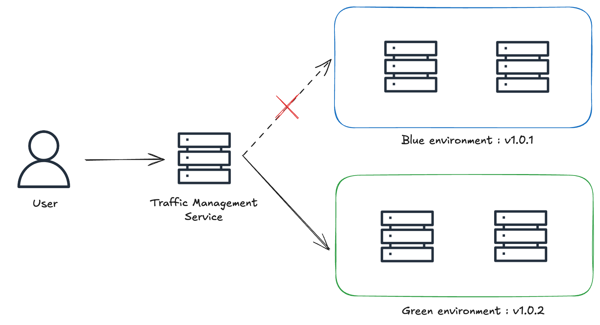
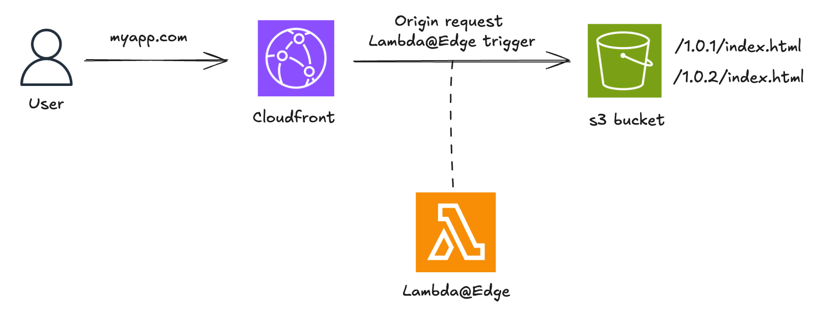
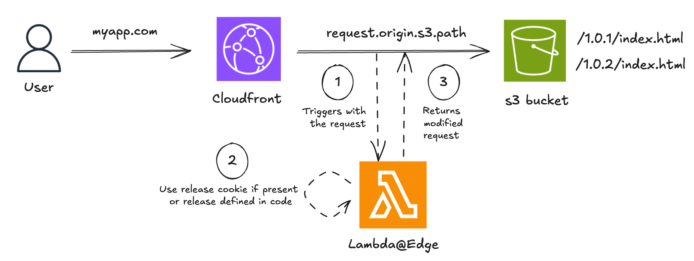

# Déploiement Blue/Green : Comment le configurer avec AWS Lambda@Edge

*Lors du déploiement d’une application web en production, il est souvent nécessaire de gérer plusieurs versions simultanément, notamment pour permettre un retour rapide et contrôlé en cas de problème. Dans cet article, nous allons voir comment utiliser AWS Lambda@Edge pour gérer plusieurs versions d’une application web, et comment cela permet de mettre en place un déploiement blue/green.*

## Qu’est-ce que le déploiement Blue/Green

Le déploiement blue/green est une stratégie dans laquelle deux environnements quasi identiques mais distincts sont maintenus en production. Un environnement (bleu, dans cet exemple) exécute la version actuelle de l’application et est accessible aux utilisateurs, tandis que l’autre (vert, dans cet exemple) héberge la nouvelle version. Une fois que l’environnement vert est stable et testé, il commence à recevoir le trafic entrant, et l’environnement bleu est mis hors service. Cette approche nécessite une couche de gestion du trafic en amont des deux environnements.



## Les avantages du déploiement Blue/Green

- **Temps d’arrêt minimisé**: Les utilisateurs continuent à accéder à l’application sans interruption notable pendant la bascule, car il n’y a pas besoin de redémarrer les serveurs ou de prévoir de fenêtres de maintenance.
- **Retours en arrière simplifiés**: Si un problème survient après le déploiement de la nouvelle version, le trafic peut facilement être redirigé vers l’environnement bleu. Le retour en arrière est rapide et évite des redéploiements stressants.
- **Risque réduit**: La nouvelle version peut être testée dans son environnement de production réel avant d’être exposée au trafic en direct.

Bien entendu, cette méthode présente aussi certains défis:

- **Coût d’infrastructure accru**: Étant donné que certaines ressources sont dupliquées, cela peut engendrer un coût plus élevé. Cependant, les services cloud permettent d’atténuer cet impact grâce à des solutions temporaires et facturées à l’usage.
- **Gestion du cache**: Le cache, sous ses différentes formes (CDN, client, serveur), peut compliquer ou retarder la bascule vers l’environnement vert. Des solutions comme l’invalidation de cache, le cache busting ou la configuration adéquate des TTL (Time to Live) permettent d’y remédier.

## Qu’est-ce que AWS Lambda@Edge

Comme l’explique la documentation AWS,
> Lambda@Edge is an extension of AWS Lambda. Lambda@Edge is a compute service that lets you execute functions that customize the content that Amazon CloudFront delivers.

CloudFront intercepts requests and responses, forwarding them to Lambda@Edge functions that can be triggered at four distinct stages:

- When CloudFront receives a request from a viewer (viewer request)
- Before CloudFront forwards a request to the origin (origin request)
- When CloudFront receives a response from the origin (origin response)
- Before CloudFront returns the response to the viewer (viewer response)


Parmi ses nombreux cas d’usage, Lambda@Edge est une excellente solution pour implémenter un déploiement blue/green dans un environnement qui utilise déjà CloudFront, en tirant parti de sa capacité à modifier les requêtes et réponses.

## Les avantages de Lambda@Edge

- **Logique au niveau du code**: Permet une logique conditionnelle complexe via le code, offrant une flexibilité quasi illimitée et des tests précis du comportement de routage.
- **Distribution transparente**: Répartition des utilisateurs sans redirection ni modification de l’URL.
- **Faible latence**: S’adapte automatiquement et traite les requêtes depuis les emplacements AWS les plus proches de l’utilisateur, ce qui réduit considérablement la latence.

Mais ce service a aussi certaines limitations:

- **Fonctionnalités restreintes**: Comparé à AWS Lambda, Lambda@Edge présente plusieurs limites, notamment:
  - **Pas de logs centralisés**: Les logs CloudWatch sont stockés dans la région où la fonction a été exécutée.
  - **Pas de variables d’environnement**: L’utilisation d’un service comme SSM pour stocker la configuration à l’exécution permet de contourner ce problème.
  - **Pas de layer de dépendances**: Il faut embarquer les dépendances directement dans le code de la fonction.
- **Complexité du cycle de vie**: Une fois déployée, une fonction Lambda@Edge n’est pas simple à supprimer complètement, car les modifications se propagent à travers les emplacements edge et peuvent prendre du temps à être totalement invalidées.

## Comment configurer Lambda@Edge

Lambda@Edge définit une fonction handler automatiquement invoquée par AWS en réponse à des événements CloudFront spécifiques. AWS transmet un objet event à la fonction, contenant les détails de la requête entrante – ou de la réponse sortante, selon le déclencheur. Le handler traite cet événement et peut modifier la requête ou la réponse avant de l’envoyer à l’origine ou de la renvoyer au client.

Dans cet exemple, on utilise une application web simple dont le frontend est servi via CloudFront depuis un bucket S3. On suppose que la nouvelle version est v1.0.2. On utilise une fonction Lambda@Edge déclenchée au niveau du origin request.



Une approche simple consiste à utiliser des cookies pour diriger les utilisateurs vers une version spécifique de l’application. Cela permet de contrôler qui voit la nouvelle version, tout en assurant une cohérence d’expérience pour un même utilisateur durant une session.



```js
"use strict";

exports.handler = async (event) => {
  const request = event.Records[0].cf.request;
  const headers = request.headers;

  let targetRelease = "1.0.2";

  const cookiesHeader = headers["cookie"] && headers["cookie"][0]?.value;

  if (cookiesHeader) {
    const cookies = cookiesHeader.split(";");
    const releaseCookie = cookies.find((cookie) =>
      cookie.startsWith("release="),
    );
    if (releaseCookie) {
      targetRelease = releaseCookie.split("=")[1];
    }
  }

  const basePath = `/${targetRelease}`;
  request.origin.s3.path = `${basePath}${request.uri}`;
  return request;
};
```

Cette configuration nécessite un redéploiement de la fonction Lambda@Edge à chaque nouvelle version. C’est fastidieux, d’autant que la propagation dans CloudFront n’est pas instantanée. On peut éviter ce redéploiement en utilisant le Parameter Store d’AWS Systems Manager pour déterminer dynamiquement la version cible. On peut également ajouter un cache pour deux raisons:

- réduire la latence liée aux appels SSM
- rester dans les limites de transactions par seconde imposées par SSM.


```js
"use strict";

const { SSMClient, GetParameterCommand } = require("@aws-sdk/client-ssm");
const client = new SSMClient({
  region: "eu-central-1",
});

let cachedReleaseVersion = null;
let lastCacheUpdateTime = 0;
const CACHE_TTL = 300000; // 5 minutes

exports.handler = async (event) => {
  const request = event.Records[0].cf.request;
  const headers = request.headers;

  const cookiesHeader =
    headers && headers["cookie"] && headers["cookie"][0]?.value;
  if (cookiesHeader) {
    const cookies = cookiesHeader.split(";");
    const releaseCookie = cookies.find((cookie) =>
      cookie.startsWith("release="),
    );
    if (releaseCookie) {
      const targetRelease = releaseCookie.split("=")[1];
      request.origin.s3.path = `/${targetRelease}${request.uri}`;
      return request;
    }
  }

  const now = Date.now();
  if (cachedReleaseVersion && now - lastCacheUpdateTime < CACHE_TTL) {
    request.origin.s3.path = `/${cachedReleaseVersion}${request.uri}`;
    return request;
  }

  const input = {
    Name: "targetRelease", // SSM Parameter Name
  };
  const result = await client.send(GetParameterCommand(input));
  cachedReleaseVersion = result.Parameter?.Value; 
  lastCacheUpdateTime = now;

  request.origin.s3.path = `/${cachedReleaseVersion}${request.uri}`;
  return request;
};

```

Avec cette configuration, la bascule entre les environnements bleu et vert consiste simplement à mettre à jour le paramètre SSM. Cela permet également un retour en arrière rapide et simplifié si nécessaire.

Bien entendu, cet exemple doit être enrichi pour un usage en production, avec une structure de code adaptée, des logs, une gestion des erreurs et des tests.

## Conclusion

Si l’approche décrite ici fonctionne bien pour des déploiements blue/green simples avec Lambda@Edge, des scénarios plus complexes peuvent nécessiter des éléments supplémentaires comme:

- **Gestion multi-composants**: Assurer la synchronisation entre plusieurs services (backend, bases de données, microservices, etc.)
- **Validation progressive**: Déployer par étape sur un sous-ensemble d’utilisateurs avant bascule complète
- **CI/CD**: Intégrer le déploiement blue/green dans des pipelines CI/CD existants, avec possibilité de retours en arrière automatisés

Pour explorer d’autres alternatives, voici un tableau comparatif des différentes solutions pour le déploiement blue/green dans AWS.

|                          | **Lambda@Edge**     | **API Gateway**       | **Route 53**             | **ELB**   |
| ------------------------ | ------------------- | --------------------- | ------------------------ | --------- |
| **Support des headers**      | Oui                 | Oui                   | Non                       | Partiel   |
| **Support des cookies**      | Oui                 | Indirect (via Lambda) | Non                       | Non        |
| **Routage par URL**    | Oui                 | Oui                   | Non                       | Oui       |
| **Support des query strings** | Oui                 | Oui                   | Non                       | Non        |
| **Pondération du trafic**    | Indirect (via code) | Indirect (via stages) | Oui                      | Oui       |

Chez Lenstra, nous avons mis en place pour nos clients des stratégies avancées comme la distribution multi-dimensionnelle du trafic et la gestion des pages de maintenance. Ces approches permettent de concilier vitesse, fiabilité et expérience utilisateur.
