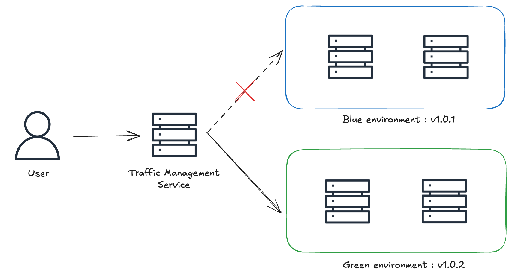
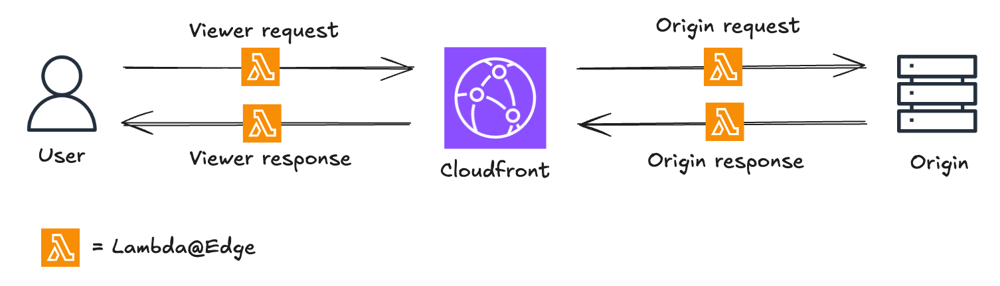
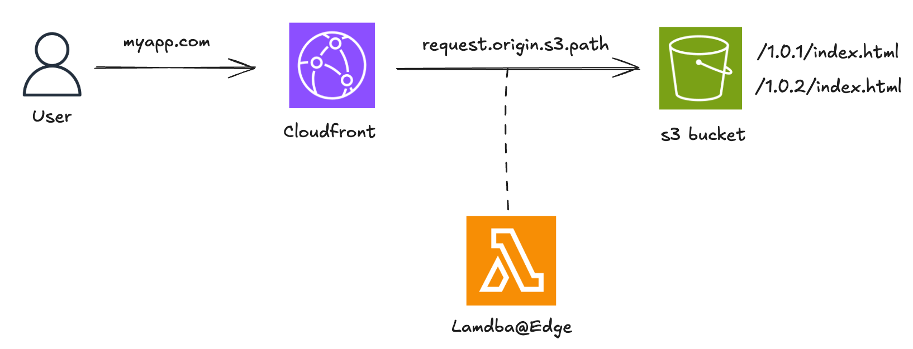
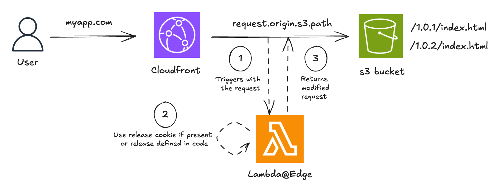
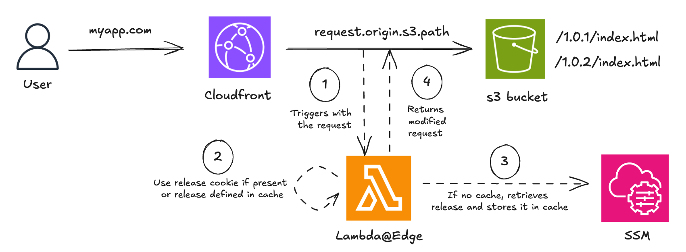

# Blue/Green deployment: How to configure it with AWS Lambda@Edge

*When deploying a web application in production, there’s often a need to manage different versions simultaneously, to allow quick and controlled rollback for instance. In this article, we'll look at how to use AWS Lambda@Edge to manage multiple versions of a web application, and how it allows for blue/green deployments.*

## What is Blue/Green deployment

Blue/Green deployment is a strategy in which two nearly identical but distinct environments are maintained in production. One environment (blue, in this example) runs the current application version and is exposed to users, while the other (green, in this example) hosts the new version. Once the green environment is stable and tested, it begins receiving incoming traffic, and the blue environment is deprecated. This approach requires a traffic management layer in front of the two environments.



## The Benefits of Blue/Green deployment

- **Minimized downtime**: Users continue to access the application with nearly no interruption during the switch, as there’s no need for server restarts or maintenance windows.
- **Simplified rollbacks**: If an issue arises after deploying the new version, traffic can easily be redirected back to the blue environment. The rollback process is quick and avoids stressful redeployments.
- **Reduced risk**: The new version can be tested in its intended production environment before being exposed to live traffic.

Of course, blue/green deployment comes with its challenges:

- **Increased Infrastructure Costs**: Since some resources are duplicated, this can lead to higher costs. However, cloud services can mitigate this issue by offering temporary, pay-as-you-go solutions.
- **Cache Management**: Cache in various forms (CDN, client-side, server-side) can complicate or delay the switch to the green environment. Effective cache invalidation, cache busting, and properly configured TTL (Time to Live) values are solutions to address this challenge.

## What is AWS Lambda@Edge

As explained in AWS documentation,
> Lambda@Edge est une extension de AWS Lambda. Lambda@Edge est un service de calcul qui vous permet d'exécuter des fonctions qui personnalisent le contenu diffusé par Amazon CloudFront.

CloudFront intercepts requests and responses, forwarding them to Lambda@Edge functions that can be triggered at four distinct stages:

- When CloudFront receives a request from a viewer (viewer request)
- Before CloudFront forwards a request to the origin (origin request)
- When CloudFront receives a response from the origin (origin response)
- Before CloudFront returns the response to the viewer (viewer response)



Among its many use cases, Lambda@Edge is an excellent solution for implementing Blue/Green deployments in an environment that already uses CloudFront, leveraging its capability to modify requests and responses

## The Advantages of Lambda@Edge

- **Code level logic**: Supports complex conditional logic through code, offering nearly unlimited flexibility and precise testing of the routing behaviour.
- **Transparent distribution**: Distributes users without re-directs or changing the URL
- **Low latency**: Scales automatically and process requests at AWS locations close to the viewer which significantly reduces latency

But it comes with a set of limitations:

- **Feature Limitations**: Compared to AWS Lambda, Lambda@Edge has several limitations including :
  - **No unified logging**: Cloudwatch logs are placed in whichever region the function executed.
  - **No environment variables**: The use of an AWS service such as SSM to store runtime configuration can help mitigate the issue.
  - **No dependencies layer**: Requires bundling dependencies directly with the function code
- **Lifecycle Complexity**: Not trivial to completely remove once deployed, as changes propagate across edge locations and may take time to be fully invalidated.

## How to configure Lambda@Edge

Lambda@Edge defines a handler function that is automatically invoked by AWS in response to specific CloudFront events. AWS passes an event object to the handler, which contains details about the incoming request - and outgoing response depending on the type of trigger. The handler processes this event and can modify the request or response before forwarding it to the origin or back to the viewer

In this example, we use a simple web application where the frontend is served through CloudFront using an S3 bucket. We suppose that the new release is v1.0.2. We use a Lambda@Edge function triggered at the origin request stage.



A straightforward approach is to use cookies to direct users to specific versions of the application. This method gives control over the audience for the new version and ensures a consistent experience for users within the same session.



```js
"use strict";

exports.handler = async (event) => {
  const request = event.Records[0].cf.request;
  const headers = request.headers;

  let targetRelease = "1.0.2";

  const cookiesHeader = headers["cookie"] && headers["cookie"][0]?.value;

  if (cookiesHeader) {
    const cookies = cookiesHeader.split(";");
    const releaseCookie = cookies.find((cookie) =>
      cookie.startsWith("release="),
    );
    if (releaseCookie) {
      targetRelease = releaseCookie.split("=")[1];
    }
  }

  const basePath = `/${targetRelease}`;
  request.origin.s3.path = `${basePath}${request.uri}`;
  return request;
};
```

This setup would require to redeploy the Lambda@Edge function for each new release. This is fastidious as propagation delay is not instantaneous within CloudFront. We can remove the need to redeploy the function by leveraging Parameter Store from AWS Systems Manager to know which release to target. We can also add cache to store the release value for two reasons:

- to minimize latency caused by calls to SSM
- to stay within the transaction-per-second limits imposed by SSM.



```js
"use strict";

const { SSMClient, GetParameterCommand } = require("@aws-sdk/client-ssm");
const client = new SSMClient({
  region: "eu-central-1",
});

let cachedReleaseVersion = null;
let lastCacheUpdateTime = 0;
const CACHE_TTL = 300000; // 5 minutes

exports.handler = async (event) => {
  const request = event.Records[0].cf.request;
  const headers = request.headers;

  const cookiesHeader =
    headers && headers["cookie"] && headers["cookie"][0]?.value;
  if (cookiesHeader) {
    const cookies = cookiesHeader.split(";");
    const releaseCookie = cookies.find((cookie) =>
      cookie.startsWith("release="),
    );
    if (releaseCookie) {
      const targetRelease = releaseCookie.split("=")[1];
      request.origin.s3.path = `/${targetRelease}${request.uri}`;
      return request;
    }
  }

  const now = Date.now();
  if (cachedReleaseVersion && now - lastCacheUpdateTime < CACHE_TTL) {
    request.origin.s3.path = `/${cachedReleaseVersion}${request.uri}`;
    return request;
  }

  const input = {
    Name: "targetRelease", // SSM Parameter Name
  };
  const result = await client.send(GetParameterCommand(input));
  cachedReleaseVersion = result.Parameter?.Value; 
  lastCacheUpdateTime = now;

  request.origin.s3.path = `/${cachedReleaseVersion}${request.uri}`;
  return request;
};

```

With this setup, switching from the blue to green environment simply involves updating the SSM Parameter. This also allows faster and easier rollbacks if needed.

Of course, this example would need to be enriched with proper code structure as well as logging, error management, and tests to be production-ready.

## Conclusion

While the approach outlined here works well for basic blue/green deployments with Lambda@Edge, more complex workflows may require additional considerations such as:

- **Multi-component management**: Ensuring synchronization across multiple services (backend, databases, microservices, etc.)
- **Progressive validation**: Implementing staged rollouts with a subset of users before a full switch
- **CI/CD**: Integrating blue/green deployment into existing CI/CD pipelines and enabling automated rollbacks if needed

To explore alternatives, here’s a comparison table of different solutions for blue/green deployment in AWS.

|                          | **Lambda@Edge**     | **API Gateway**       | **Route 53**             | **ELB**   |
| ------------------------ | ------------------- | --------------------- | ------------------------ | --------- |
| **Headers Support**      | Yes                 | Yes                   | No                       | Partial   |
| **Cookies Support**      | Yes                 | Indirect (via Lambda) | No                       | No        |
| **URL-Based Routing**    | Yes                 | Yes                   | No                       | Yes       |
| **Query String Support** | Yes                 | Yes                   | No                       | No        |
| **Traffic Weighting**    | Indirect (via code) | Indirect (via stages) | Yes                      | Yes       |

At Lenstra, we have implemented for our clients advanced strategies such as multi-dimensional traffic distribution and maintenance page management. These approaches help balance speed, reliability, and user experience.
